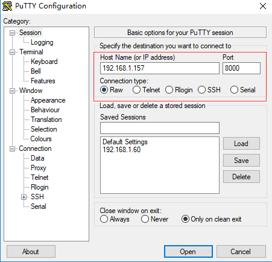
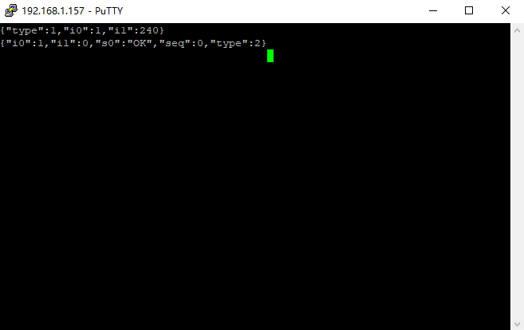

# JdPlaySS协议 V1.0

标签（空格分隔）： 网络通信 ServerSocket 局域网

---

## 概述

JdPlaySS是JdPlay Server Socket的缩写，参考了mqtt、DLNA协议的思想，是基于TCP协议的简易Server Socket，可用于非Android/iOS系统（如Linux网关）下的局域网背景音系统控制，并可支持多个客户端同时连接。

## 条件&约束

C/S传输数据格式采用json, 且以换行符作为消息分割符。因此不允许消息中存在实际的换行符，但可以存在转义换行符。

## 发现协议

设备发现采用DLNA的设备发现机制。Client加入组播组并发送SSDP M-SEARCH包到组播地址239.255.255.250:1900端口，也可以直接对当前局域网的广播地址(如192.168.1.255)直接发送SSDP M-SEARCH广播包。参考M-SEARCH包数据如下：
```
M-SEARCH * HTTP/1.1
MX: 2
ST: upnp:rootdevice
MAN: "ssdp:discover"
User-Agent: UPnP/1.0 DLNADOC/1.50 JdPlay/1.0.0
Connection: close
Host: 239.255.255.250:1900
```

Client监听到SSDP NOTIFY包，解析包如果含有EXT字段并该字段含有`JDPLAY`关键字，则发现背景音系统，如果版本号大于XXX,则可以通过本协议来控制。 参考NOTIFY包数据如下：
```
NOTIFY * HTTP/1.1
Host: 239.255.255.250:1900
Location: http://192.168.1.154:1500/
Cache-Control: max-age=100
Server: UPnP/1.0 DLNADOC/1.50 EglPlay/1.0.0
BOOTID.UPNP.ORG: 1490004021
EXT: JDPLAY/2.1.1
NTS: ssdp:alive
USN: uuid:10000003816::urn:schemas-upnp-org:device:MediaRenderer:1
NT: urn:schemas-upnp-org:device:MediaRenderer:1
```

## 控制协议

### 消息格式

C/S直接数据传递采用如下字段，注意seq=0保留给服务器端消息的主动反馈。

```
{
    "type": [int][必选]控制包类型,
    "seq": [int][可选] 控制包序号,
    "s0": [string][可选] 字符串参数0,
    "s1": [string][可选] 字符串参数1,
    "i0": [int][可选] 整形参数0,
    "i1": [int)[可选] 整形参数1,
}
```

#### 消息类型

消息包类型有如下几种

|type类型值| 传输方向 | 描述  |
|------------|------------|------------|
|1 | C->S        |CONNECT: 连接请求    |
|2 | S->C        |CONNACK: 连接应答    |
|3 | C->S<br>S->C|PUBLISH: 发布消息    |
|4 | C->S<br>S->C|PUBACK: 发布消息确认 |
|12| C->S        |PINGREQ: 心跳请求    |
|13| S->C        |PINGRESP: 心跳反馈   |
|14| C->S        |DISCONNECT: 断开请求 |

### 消息描述

#### CONNECT
i0: version 客户端协议版本，本协议为1<br>
i1: keepalive 心跳包时间，单位秒，范围(10~600秒)，建议值300, 客户端每隔240秒，发一次心跳包或者传输一次数据。

#### CONNACK

i0: version 服务器端协议版本，本协议为1 <br>
i1: 0:成功 -1:失败<br>
s0: 反馈的消息字符串，用于调试

#### PUBLISH

用于C/S之间消息传递，目前支持２种消息，控制消息（C->S）和状态主动(S->C)反馈的消息。Client发送消息给Server时，Server会回复PUBACK消息；Server主动反馈消息给Client时，Client端无需回复PUBACK消息。

seq: [必选] 消息序号,从1开始递增（0:保留给Server消息主动发送)<br>
i0: [必选] cmd命令，支持的命令及参数设置如下。

|命令值|命令名 | 方向 | 功能| 请求参数  | PubAck回复参数|
|--------|--------|--------|--------|--------|--------|
|100|MEDIA_GET_METADATA | C->S|  获取元数据 | 无  | s0:参考元数据 |
|101|MEDIA_PLAY | C->S| 播放  | 无  | 无参数  |
|102|MEDIA_PAUSE | C->S| 暂停  | 无  | 无参数  |
|103|MEDIA_NEXT | C->S|下一首   | 无  | 无参数  |
|104|MEDIA_PREV | C->S|上一首   | 无  | 无参数  |
|105|MEDIA_SEEK | C->S|跳播   | i1: 跳播位置，单位秒  | 无参数  |
|106|MEDIA_GET_POSITION | C->S|获取播放位置   | 无  | s0: 当前时间(秒):总时间(秒)  |
|107|MEDIA_SET_VOLUME | C->S| 设置音量  | i1: 音量值(0~100)  | 无参数  |
|108|MEDIA_GET_VOLUME | C->S| 获取音量 | 无  | i1: 音量值(0~100)  |
|109|MEDIA_GET_ALL_LOCAL_MEDIA | C->S| 获取所有本地歌曲信息 | 无  | s0:简单音乐元数据数组  |
|110|MEDIA_PLAY_LOCAL_SONG | C->S| 播放本地歌曲 | s0:简单音乐元数据数组 i1:开始播放索引  | 无参数  |
|111|MEDIA_SWITCH_PLAY_MODE | C->S| 切换播放模式，如果是电台类，会提示不支持电台类模式切换 | 无  | 无参数  |
|112|MEDIA_GET_SCENE_MUSICS | C->S| 获取所有场景音乐 | 无  | s0: 简单音乐元数据数组,场景音乐有效字段只有songId, songTitle  |
|113|MEDIA_PLAY_SCENE_MUSIC | C->S| 播放场景音乐 | i1:场景音乐id,即元数据中的songId字段  | 无参数　|
|114|MEDIA_PLAY_LOCAL_ONE_SONG | C->S| 播放本地单首歌曲，单曲不循环 | s0:仅一个简单音乐元数据，非数组  | 无参数　|
|115|MEDIA_GET_PLAY_MODE | C->S| 获取当前播放模式 | 无  | <br> i1: 播放模式 <br> 0:重复所有<br>1:单曲循环<br> 2:随机播放<br>　|
|116|MEDIA_PLAY_TTS | C->S| 用语音播放TTS文本 | s0:TTS文本  | 无参数　|
|118|MEDIA_PLAY_HINT_PATH | C->S| 播放提示音 | s0:完整的提示音路径  | 无参数　|
|119|MEDIA_GET_AUDIO_SOURCE | C->S| 获取当前的音源 | 无  | s0: 当前的音源　|
|120|MEDIA_SET_AUDIO_SOURCE | C->S| 切换音源 | s0:目标音源  | 无参数　|
|150|MEDIA_REPORT_METADATA | S->C| 反馈元数据  | s0:参考元数据  | Client无需回复  |
|151|MEDIA_REPORT_PlAY_STATE | S->C| 反馈播放状态  | i1: 播放状态 <br> 0:暂停<br>1:正在播放<br> 2:缓冲结束<br> | Client无需回复  |
|152|MEDIA_REPORT_VOLUME | S->C| 反馈音量  | i1:音量值(0~100)  | Client无需回复  |
|153|MEDIA_REPORT_PLAY_MODE | S->C| 反馈当前的播放模式 | i1: 播放模式 <br> 0:重复所有<br>1:单曲循环<br> 2:随机播放<br>  | Client无需回复  |
|200|DEVICE_POWER_ON | C->S| 开机 | 无  | 无参数  |
|201|DEVICE_POWER_OFF | C->S| 关机 | 无  | 无参数  |
|202|DEVICE_POWER_REBOOT | C->S| 重启 | 无  | 无参数  |
|203|DEVICE_GET_POWER_STATUS | C->S| 获取开机状态 | 无  | i1: 0表示关机，1表示开机  |

##### 元数据
```json
{
  "playState": 1,
  "singer": "刘德华",
  "songId": "548408",
  "songTitle": "爱你一万年",
  "songUrl": "http://www.xxx.com/1.mp3",
  "volume": 80
}
```
##### 简单音乐元数据
```json
{
  "songId": "548408",
  "songTitle": "爱你一万年",
}
```

#### PUBACK

i0: 跟PUBLISH cmd命令值一致<br>
i1,s0: [可选]，如果需要反馈消息

回复参数如上表格

#### PINGREQ

无参数

#### PINGRESP

无参数

#### DISCONNECT
无参数

## 集成＆开发

### Client端流程
1. 通过DLNA设备发现发现背景音主机设备
2. 建立socket链接，TCP连接到设备IP地址的8000端口， 开始socket收发数据，并以换行符作为包分隔符。
3. 发送CONNECT请求，参考发送数据 `{"type":1,"i0":1,"i1":240}`
等待Server端反馈连接成功。 参考接收到的数据`{"i0":1,"i1":0,"s0":"OK","seq":0,"type":2}`
4. 如果连接成功，发送 PUBLISH/MEDIA_GET_METADATA 请求，获取元数据。 参考发送数据`{"type":3,"i0":100,"seq":1}`
5. 根据播放状态决定是否周期性读取播放位置，如果 s0.playState=1, 发送获取播放位置请求，参考发送数据 `{"type":3,"i0":106,"seq":1}`
6. 客户端需要在KeepAlive时间周期内发送数据给服务端以维持长连接,否则服务器端超时会主动断开连接。客户端也需要检测PINGREQ/PINGRESP消息或ACK消息是否收到，如果客户端检测到通信链路异常，则需要跟服务端重连。
7. 接收线程可能监听到元数据、播放状态以及音量改变的消息。

### 测试＆调试方法

1. 进入背景音系统 “设置>网络设置”, 查看ip地址，通过telnet连接背景音系统
> telnet ip地址 8000

2. 根据如上"Client端流程",在telnet终端通过命令测试交互
```c
=> telnet 192.168.1.154 8000
Trying 192.168.1.154...
Connected to 192.168.1.154.
Escape character is '^]'.
{"type":1,"i0":1,"i1":240}                
{"i0":1,"i1":0,"s0":"OK","seq":0,"type":2}
{"type":3,"i0":101,"seq":1}
{"i0":101,"i1":0,"seq":1,"type":4}
{"i0":150,"i1":0,"s0":"{\"playState\":0,\"singer\":\"Brooke White\",\"songId\":\"1552954\",\"songTitle\":\"Let It Be\",\"songUrl\":\"http://mr3.doubanio.com/87b89194e8858151bf1375eb17c96878/0/fm/song/p1552954_128k.mp3\",\"volume\":40}","seq":0,"type":3}
{"i0":151,"i1":2,"seq":0,"type":3}
{"type":3,"i0":102,"seq":1}
{"i0":151,"i1":0,"seq":0,"type":3}
{"i0":102,"i1":0,"seq":1,"type":4}
```
发送”连接请求“命令 
```c
{"type":1,"i0":1,"i1":240}
```
背景音系统返回 
```c
{"i0":1,"i1":0,"s0":"OK","seq":0,"type":2}
```
发送”播放“命令 
```c
{"type":3,"i0":101,"seq":1} 
```
背景音系统返回 
```c
{"i0":101,"i1":0,"seq":1,"type":4}
{"i0":150,"i1":0,"s0":"{\"playState\":0,\"singer\":\"Brooke White\",\"songId\":\"1552954\",\"songTitle\":\"Let It Be\",\"songUrl\":\"http://mr3.doubanio.com/87b89194e8858151bf1375eb17c96878/0/fm/song/p1552954_128k.mp3\",\"volume\":40}","seq":0,"type":3}
{"i0":151,"i1":2,"seq":0,"type":3}
```
发送”暂停“命令 
```c 
{"type":3,"i0":102,"seq":1}
```
背景音系统返回
```c
{"i0":151,"i1":0,"seq":0,"type":3}
{"i0":102,"i1":0,"seq":1,"type":4}
```
## 参考

### 常量定义
为简化开发者工作量，常量定义如下：
```java
public class JSSSConstant {
    public static final int VERSION = 1;

    //JSSS协议命令
    public static final int CONNECT = 1;
    public static final int CONNACK = 2;
    public static final int PUBLISH = 3;
    public static final int PUBACK = 4;
    public static final int PINGREQ = 12;
    public static final int PINGRESP = 13;
    public static final int DISCONNECT = 14;

    //JSSS协议媒体控制命令
    public static final int MEDIA_GET_METADATA = 100;
    public static final int MEDIA_PLAY = 101;
    public static final int MEDIA_PAUSE = 102;
    public static final int MEDIA_NEXT = 103;
    public static final int MEDIA_PREV = 104;
    public static final int MEDIA_SEEK = 105;
    public static final int MEDIA_GET_POSITION = 106;
    public static final int MEDIA_SET_VOLUME = 107;
    public static final int MEDIA_GET_VOLUME = 108;
    public static final int MEDIA_GET_ALL_LOCAL_MEDIA = 109;
    public static final int MEDIA_PLAY_LOCAL_SONG = 110;
    public static final int MEDIA_SWITCH_PLAY_MODE = 111;
    public static final int MEDIA_GET_SCENE_MUSICS = 112;
    public static final int MEDIA_PLAY_SCENE_MUSIC = 113;
    public static final int MEDIA_PLAY_ONCE_LOCAL_SONG = 114;
    public static final int MEDIA_GET_PLAY_MODE = 115;
    public static final int MEDIA_PLAY_TTS = 116;
    public static final int MEDIA_PLAY_HINT_PATH = 118;
    public static final int MEDIA_GET_AUDIO_SOURCE = 119;
    public static final int MEDIA_SET_AUDIO_SOURCE = 120;

    //JSSS协议媒体状态反馈命令
    public static final int MEDIA_REPORT_METADATA = 150;
    public static final int MEDIA_REPORT_PlAY_STATE = 151;
    public static final int MEDIA_REPORT_VOLUME = 152;
    public static final int MEDIA_REPORT_PLAY_MODE = 153;
    
    //JSSS协议设备控制命令
    public static final int DEVICE_POWER_ON = 200;
    public static final int DEVICE_POWER_OFF = 201;
    public static final int DEVICE_POWER_REBOOT = 202;
    public static final int DEVICE_GET_POWER_STATUS = 203;
    //JSSS 状态码
    public static final int FAIL = -1;
    public static final int OK = 0;
}
```

### 常用命令

|命令|转换后命令 |
|--------|--------|
|连接请求|{"type":1,"i0":1,"i1":240} |
|播放|{"type":3,"i0":101,"seq":1} |
|暂停|{"type":3,"i0":102,"seq":1} |
|获取元数据|{"type":3,"i0":100,"seq":1} |
|获取播放位置|{"type":3,"i0":106,"seq":1}|

## FAQ

Q: 为什么Server端Socket连接会主动断开<br>
A: 请检查是否在KeepAlive时间内发送过PING或者PUBLISH命令

Q: 为什么Client发布消息不成功<br>
A: 请检查seq字段是否设置为非０值，并主动递增

Q: Window 使用 PuTTY 进行测试<br>
A:  <br>
发送连接请求{"type":1,"i0":1,"i1":240}<br>

